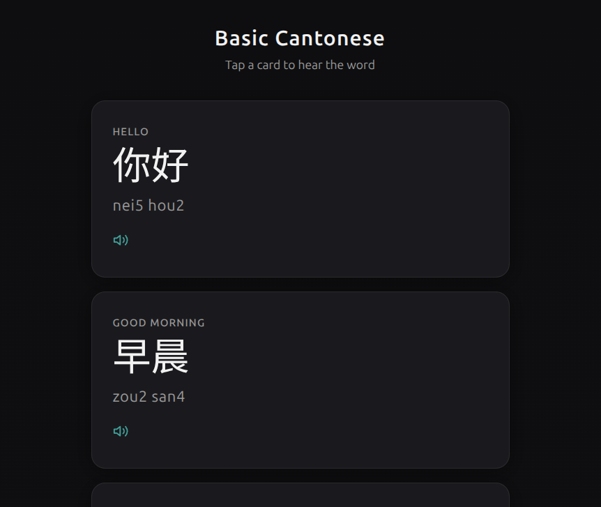

# Basic Cantonese

A minimal static web app for learning everyday Cantonese words. Each card shows the English meaning, Chinese characters, Jyutping romanization, and plays the pronunciation on tap.



## Usage

Open `index.html` directly in a browser, or serve the directory with any static file server:

```bash
python3 -m http.server 8000
```

Then visit `http://localhost:8000`.

## Audio

The app tries to load pre-recorded clips from `audio/<id>.mp3` first. If a file is missing, it falls back to the Web Speech API with `lang="zh-HK"`. Drop your own recordings into `audio/` using the IDs from `app.js` (e.g. `audio/hello.mp3`).

## Word list

22 entries covering greetings, common phrases, and numbers 1-10. All data is inline in `app.js`.

## Stack

Plain HTML, CSS, and JS - no build step, no dependencies.
